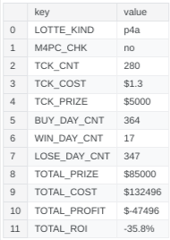
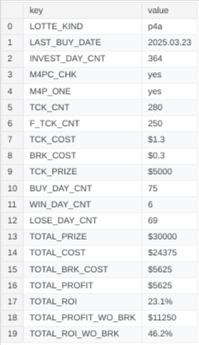
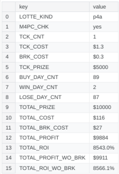
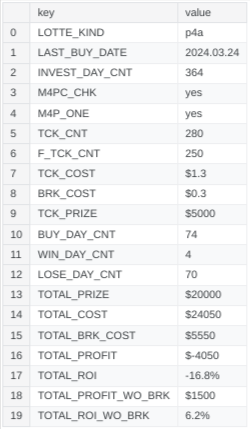
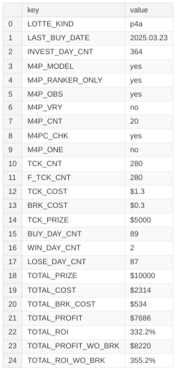

```
              _   _   _    _   _ _  
  ___ _ _ ___| |_| |_(_)__| |_| | | 
 / _ \ '_/ _ \  _|  _| / _| / /_  _|
 \___/_| \___/\__|\__|_\__|_\_\ |_| 
------------------------------------
 Oregon Lottery - Pick 4 Predictor
------------------------------------

====================================
        RESEARCH PROJECT A
  -------------------------------
```


```
  -------------------------------
              PLAN A
  -------------------------------

+ LOTTE_KIND: p4a
+ LAST_BUY_DATE: 2025.03.23
+ PERIOD_SIZE: 7
+ PERIOD_CNT: 52
+ DATE_CNT: 280
+ TCK_CNT: 280
+ PRD_SORT_ORDER: B
+ M4P_OBS: False
+ M4P_CNT: 3
+ M4P_VRY: False
+ M4PC_CHK: False
+ TCK_KIND: All 4 exact order
+ BROKER_COST: $0.3 / ticket

==> [GOAL] Simulate buying tickets and calculate ROI.


  -------------------------------
             PROCESS A
  -------------------------------

+ Simulating Notebook: https://www.kaggle.com/code/dinhttrandrise/orottick4-observe-rsp-a-f-2025-03-23

+ Analyzing Notebook: https://www.kaggle.com/code/dinhttrandrise/orottick4-analyze-rsp-a-a-2025-03-23


  -------------------------------
             ANALYZE A
  -------------------------------
```




```
  -------------------------------
              PLAN B
  -------------------------------

+ LOTTE_KIND: p4a
+ LAST_BUY_DATE: 2025.03.23
+ PERIOD_SIZE: 7
+ PERIOD_CNT: 52
+ DATE_CNT: 280
+ TCK_CNT: 280
+ F_TCK_CNT: 250
+ PRD_SORT_ORDER: B
+ M4P_OBS: False
+ M4P_CNT: 3
+ M4P_VRY: False
+ M4PC_CHK: True
+ M4P_ONE: True
+ TCK_KIND: All 4 exact order
+ BROKER_COST: $0.3 / ticket

==> [GOAL] Simulate buying tickets and calculate ROI.


  -------------------------------
             PROCESS B
  -------------------------------

+ Simulating Notebook: https://www.kaggle.com/code/dinhttrandrise/orottick4-observe-rsp-a-f-2025-03-23

+ Analyzing Notebook: https://www.kaggle.com/code/dinhttrandrise/orottick4-analyze-rsp-a-b-2025-03-23


  -------------------------------
             ANALYZE B
  -------------------------------
```




```
  -------------------------------
              PLAN C
  -------------------------------

+ LOTTE_KIND: p4a
+ LAST_BUY_DATE: 2025.03.23
+ PERIOD_SIZE: 7
+ PERIOD_CNT: 52
+ DATE_CNT: 280
+ TCK_CNT: 280
+ PRD_SORT_ORDER: B
+ M4P_OBS: True
+ M4P_CNT: 3
+ M4P_VRY: True
+ M4PC_CHK: True
+ TCK_KIND: All 4 exact order
+ BROKER_COST: $0.3 / ticket

==> [GOAL] Simulate buying tickets and calculate ROI.


  -------------------------------
             PROCESS C
  -------------------------------

+ Simulating Notebook: https://www.kaggle.com/code/dinhttrandrise/orottick4-observe-rsp-a-f-m4p-2025-03-23

+ Analyzing Notebook: https://www.kaggle.com/code/dinhttrandrise/orottick4-analyze-rsp-a-c-2025-03-23


  -------------------------------
             ANALYZE C
  -------------------------------
```




```
  -------------------------------
              PLAN D
  -------------------------------

+ LOTTE_KIND: p4a
+ LAST_BUY_DATE: 2024.03.24
+ PERIOD_SIZE: 7
+ PERIOD_CNT: 52
+ DATE_CNT: 280
+ TCK_CNT: 280
+ F_TCK_CNT: 250
+ PRD_SORT_ORDER: B
+ M4P_OBS: False
+ M4P_CNT: 3
+ M4P_VRY: False
+ M4PC_CHK: True
+ M4P_ONE: True
+ TCK_KIND: All 4 exact order
+ BROKER_COST: $0.3 / ticket

==> [GOAL] Simulate buying tickets and calculate ROI.


  -------------------------------
             PROCESS D
  -------------------------------

+ Simulating Notebook: https://www.kaggle.com/code/dinhttrandrise/orottick4-observe-rsp-a-f-2024-03-24

+ Analyzing Notebook: https://www.kaggle.com/code/dinhttrandrise/orottick4-analyze-rsp-a-d-2024-03-24


  -------------------------------
             ANALYZE D
  -------------------------------
```




```
  -------------------------------
              PLAN G
  -------------------------------

+ LOTTE_KIND: p4a
+ LAST_BUY_DATE: 2025.03.23
+ PERIOD_SIZE: 7
+ PERIOD_CNT: 52
+ DATE_CNT: 280
+ TCK_CNT: 280
+ F_TCK_CNT: 280
+ PRD_SORT_ORDER: B
+ M4P_OBS: True
+ M4P_CNT: 20
+ M4P_VRY: False
+ M4PC_CHK: True
+ M4P_ONE: False
+ M4P_OBS: True
+ M4P_MODEL: True
+ M4P_RANKER_ONLY: True
+ TCK_KIND: All 4 exact order
+ BROKER_COST: $0.3 / ticket

==> [GOAL] Simulate buying tickets and calculate ROI.


  -------------------------------
             PROCESS G
  -------------------------------

+ Simulating Notebook: https://www.kaggle.com/code/dinhttrandrise/orottick4-observe-rsp-a-g-2025-03-23

+ Analyzing Notebook: https://www.kaggle.com/code/dinhttrandrise/orottick4-analyze-rsp-a-g-2025-03-23


  -------------------------------
             ANALYZE G
  -------------------------------
```



