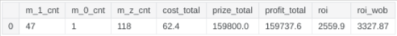

```
              _   _   _    _   _ _  
  ___ _ _ ___| |_| |_(_)__| |_| | | 
 / _ \ '_/ _ \  _|  _| / _| / /_  _|
 \___/_| \___/\__|\__|_\__|_\_\ |_| 
------------------------------------
 Oregon Lottery - Pick 4 Predictor
------------------------------------

====================================
        RESEARCH PROJECT B
  -------------------------------
```


```
  -------------------------------
              PLAN A
  -------------------------------

+ LOTTE_KIND: p4a
+ LAST_BUY_DATE: 2025.01.01
+ FIRST_BUY_DATE: 2024.09.05
+ TCK_KIND: All 4 exact order
+ BROKER_COST: $0.3 / ticket

==> [GOAL] Simulate buying tickets and calculate ROI.


  -------------------------------
             PROCESS A
  -------------------------------

+ Analyzing Notebook: https://www.kaggle.com/code/dinhttrandrise/orottick4pc-analyze-p4a-1-2025-01-01


  -------------------------------
             ANALYZE A
  -------------------------------
```




